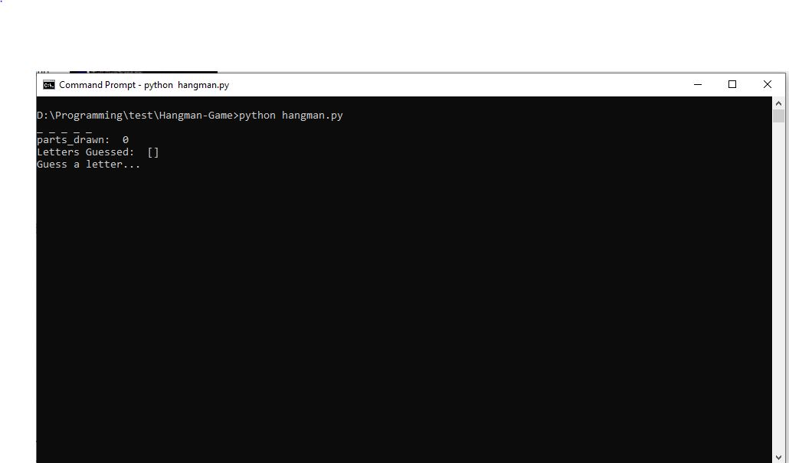
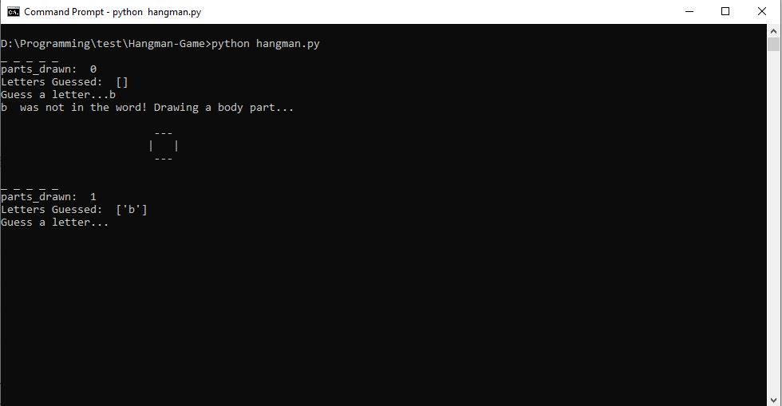
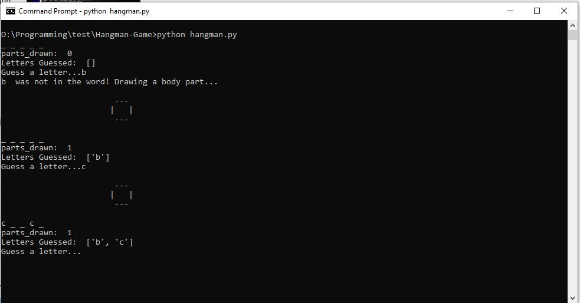
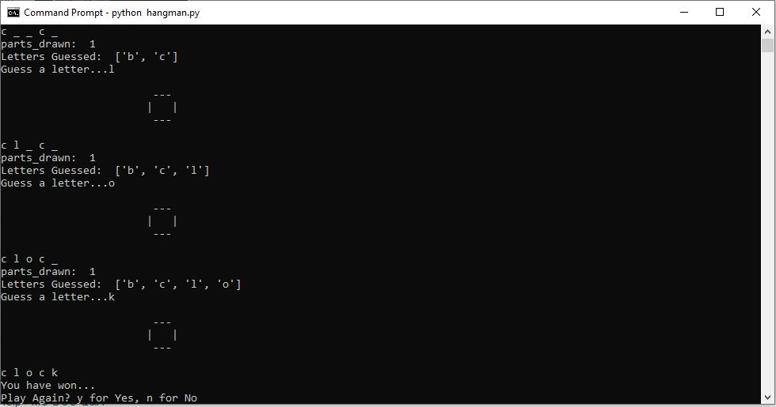

# HangmanGame
Simple Terminal Based Hangman Game

## Introduction

This is a simple terminal based hangman game which pulls words randomly from the word_master_list.txt file and shows the blanks for the word. It gives you 6 wrong guesses, and for each wrong guess will draw a body part on the hangman. 

## Screenshots

|  | 
|:--:| 
| *Initial Loading Screen* |

|  | 
|:--:| 
| *Wrong Message* |

|  | 
|:--:| 
| *Correct Message* |

|  | 
|:--:| 
| *Play Again?* |

